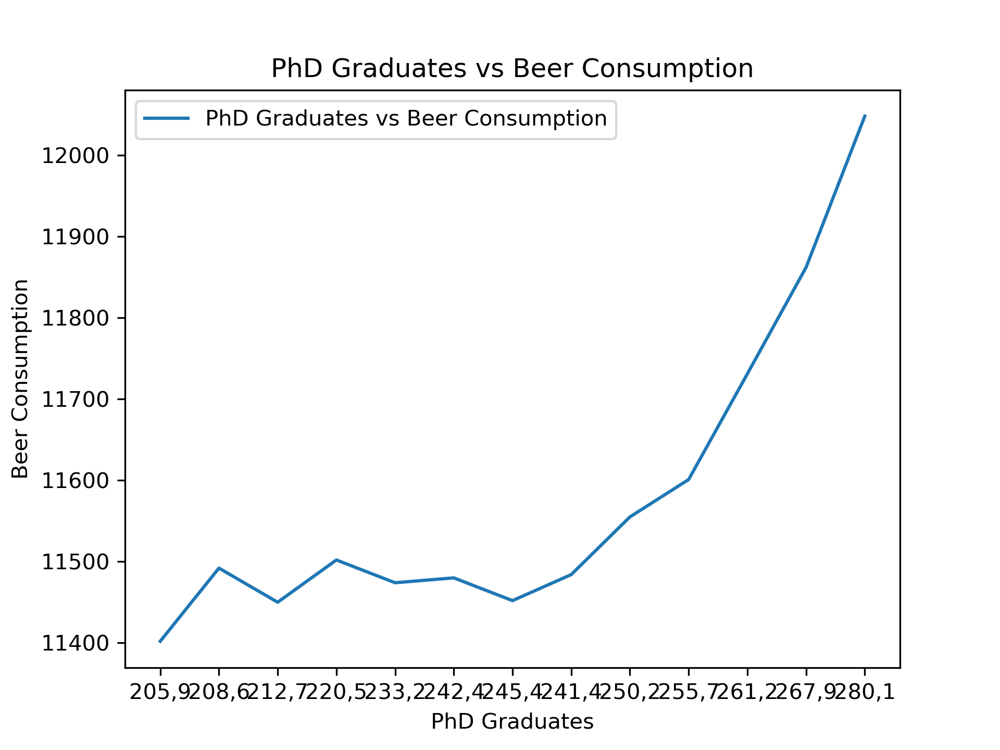

**Student ID:** 12345678

## Key Papers:
1. MCC Van Dyke et al., 2019
2. JT Harvey, *Applied Ergonomics*, 2002
3. DW Ziegler et al., 2005

There is a positive exponential relationship between PhD graduates and beer consumption. There are likely external factors not shown in the data that are causing the apparent relationship. 
